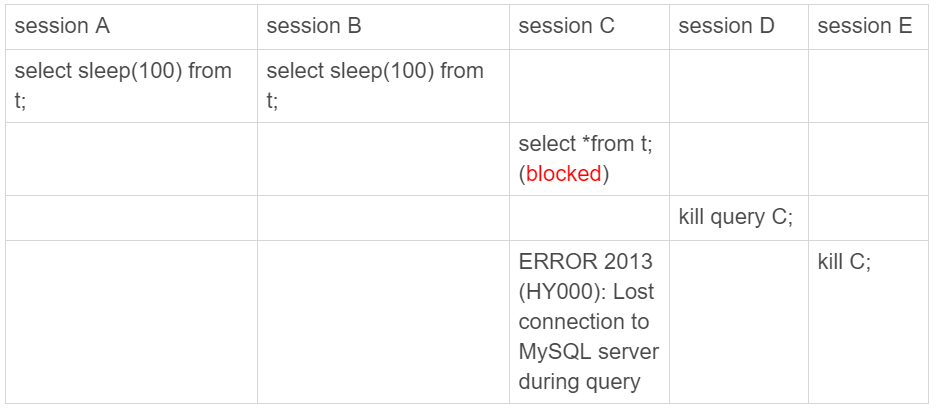

[toc]
# 32 为什么还有kill不掉的语句？

在 MySQL 中有两个 kill 命令：一个是 kill query + 线程 id，表示终止这个线程中正在执行的语句；一个是 kill connection + 线程 id，这里 connection 可缺省，表示断开这个线程的连接，当然如果这个线程有语句正在执行，也是要先停止正在执行的语句的。

不知道你在使用 MySQL 的时候，有没有遇到过这样的现象：使用了 kill 命令，却没能断开这个连接。再执行 show processlist 命令，看到这条语句的 Command 列显示的是 Killed。

你一定会奇怪，显示为 Killed 是什么意思，不是应该直接在 show processlist 的结果里看不到这个线程了吗？

今天，我们就来讨论一下这个问题。

其实大多数情况下，kill query/connection 命令是有效的。比如，执行一个查询的过程中，发现执行时间太久，要放弃继续查询，这时我们就可以用 kill query 命令，终止这条查询语句。

还有一种情况是，语句处于锁等待的时候，直接使用 kill 命令也是有效的。我们一起来看下这个例子：


图 1 kill query 成功的例子

可以看到，session C 执行 kill query 以后，session B 几乎同时就提示了语句被中断。这，就是我们预期的结果。

# 收到 kill 以后，线程做什么？

但是，这里你要停下来想一下：session B 是直接终止掉线程，什么都不管就直接退出吗？显然，这是不行的。

我在\[第 6 篇文章\]中讲过，当对一个表做增删改查操作时，会在表上加 MDL 读锁。所以，session B 虽然处于 blocked 状态，但还是拿着一个 MDL 读锁的。如果线程被 kill 的时候，就直接终止，那之后这个 MDL 读锁就没机会被释放了。

这样看来，kill 并不是马上停止的意思，而是告诉执行线程说，这条语句已经不需要继续执行了，可以开始"执行停止的逻辑了"。
> 其实，这跟 Linux 的 kill 命令类似，kill -N pid 并不是让进程直接停止，而是给进程发一个信号，然后进程处理这个信号，进入终止逻辑。只是对于 MySQL 的 kill 命令来说，不需要传信号量参数，就只有"停止"这个命令。

**实现上，当用户执行 kill query thread_id_B 时，MySQL 里处理 kill 命令的线程做了两件事：**

1. 把 session B 的运行状态改成 THD::KILL_QUERY(将变量 killed 赋值为 THD::KILL_QUERY)；
2. 给 session B 的执行线程发一个信号。

为什么要发信号呢？

因为像图 1 的我们例子里面，session B 处于锁等待状态，如果只是把 session B 的线程状态设置 THD::KILL_QUERY，线程 B 并不知道这个状态变化，还是会继续等待。发一个信号的目的，就是让 session B 退出等待，来处理这个 THD::KILL_QUERY 状态。

上面的分析中，隐含了这么三层意思：

1. 一个语句执行过程中有多处"埋点"，在这些"埋点"的地方判断线程状态，如果发现线程状态是 THD::KILL_QUERY，才开始进入语句终止逻辑；
2. 如果处于等待状态，必须是一个可以被唤醒的等待，否则根本不会执行到"埋点"处；
3. 语句从开始进入终止逻辑，到终止逻辑完全完成，是有一个过程的。

到这里你就知道了，原来不是"说停就停的"。

接下来，我们**再看一个 kill 不掉的例子**，也就是我们在前面\[第 29 篇文章\]中提到的 innodb_thread_concurrency 不够用的例子。

首先，执行 set global innodb_thread_concurrency=2，将 InnoDB 的并发线程上限数设置为 2；然后，执行下面的序列：



图 2 kill query 无效的例子

可以看到：

1. sesssion C 执行的时候被堵住了；
2. 但是 session D 执行的 kill query C 命令却没什么效果，
3. 直到 session E 执行了 kill connection 命令，才断开了 session C 的连接，提示"Lost connection to MySQL server during query"，
4. 但是这时候，如果在 session E 中执行 show processlist，你就能看到下面这个图。


图 3 kill connection 之后的效果

这时候，id=12 这个线程的 Commnad 列显示的是 Killed。也就是说，客户端虽然断开了连接，但实际上服务端上这条语句还在执行过程中。

**为什么在执行 kill query 命令时，这条语句不像第一个例子的 update 语句一样退出呢？**

在实现上，等行锁时，使用的是 pthread_cond_timedwait 函数，这个等待状态可以被唤醒。但是，在这个例子里，12 号线程的等待逻辑是这样的：每 10 毫秒判断一下是否可以进入 InnoDB 执行，如果不行，就调用 nanosleep 函数进入 sleep 状态。

也就是说，虽然 12 号线程的状态已经被设置成了 KILL_QUERY，但是在这个等待进入 InnoDB 的循环过程中，并没有去判断线程的状态，因此根本不会进入终止逻辑阶段。

而当 session E 执行 kill connection 命令时，是这么做的，

1. 把 12 号线程状态设置为 KILL_CONNECTION；
2. 关掉 12 号线程的网络连接。因为有这个操作，所以你会看到，这时候 session C 收到了断开连接的提示。

那为什么执行 show processlist 的时候，会看到 Command 列显示为 killed 呢？其实，这就是因为在执行 show processlist 的时候，有一个特别的逻辑：

```hljs language-undefined
如果一个线程的状态是 KILL_CONNECTION，就把 Command 列显示成 Killed。
```

所以其实，即使是客户端退出了，这个线程的状态仍然是在等待中。那这个线程什么时候会退出呢？

答案是，只有等到满足进入 InnoDB 的条件后，session C 的查询语句继续执行，然后才有可能判断到线程状态已经变成了 KILL_QUERY 或者 KILL_CONNECTION，再进入终止逻辑阶段。

到这里，我们来小结一下。

**这个例子是 kill 无效的第一类情况，即：线程没有执行到判断线程状态的逻辑。**跟这种情况相同的，还有由于 IO 压力过大，读写 IO 的函数一直无法返回，导致不能及时判断线程的状态。

**另一类情况是，终止逻辑耗时较长。**这时候，从 show processlist 结果上看也是 Command=Killed，需要等到终止逻辑完成，语句才算真正完成。这类情况，比较常见的场景有以下几种：

1. 超大事务执行期间被 kill。这时候，回滚操作需要对事务执行期间生成的所有新数据版本做回收操作，耗时很长。
2. 大查询回滚。如果查询过程中生成了比较大的临时文件，加上此时文件系统压力大，删除临时文件可能需要等待 IO 资源，导致耗时较长。
3. DDL 命令执行到最后阶段，如果被 kill，需要删除中间过程的临时文件，也可能受 IO 资源影响耗时较久。

之前有人问过我，如果直接在客户端通过 Ctrl+C 命令，是不是就可以直接终止线程呢？

答案是，不可以。

这里有一个误解，其实在客户端的操作只能操作到客户端的线程，客户端和服务端只能通过网络交互，是不可能直接操作服务端线程的。

而由于 MySQL 是停等协议，所以这个线程执行的语句还没有返回的时候，再往这个连接里面继续发命令也是没有用的。实际上，执行 Ctrl+C 的时候，是 MySQL 客户端另外启动一个连接，然后发送一个 kill query 命令。

所以，你可别以为在客户端执行完 Ctrl+C 就万事大吉了。因为，要 kill 掉一个线程，还涉及到后端的很多操作。

# 另外两个关于客户端的误解

在实际使用中，我也经常会碰到一些同学对客户端的使用有误解。接下来，我们就来看看两个最常见的误解。

**第一个误解是：如果库里面的表特别多，连接就会很慢。**

有些线上的库，会包含很多表（我见过最多的一个库里有 6 万个表）。这时候，你就会发现，每次用客户端连接都会卡在下面这个界面上。


图 4 连接等待

而如果 db1 这个库里表很少的话，连接起来就会很快，可以很快进入输入命令的状态。因此，有同学会认为是表的数目影响了连接性能。

从\[第一篇文章\]你就知道，每个客户端在和服务端建立连接的时候，需要做的事情就是 TCP 握手、用户校验、获取权限。但这几个操作，显然跟库里面表的个数无关。

但实际上，正如图中的文字提示所说的，当使用默认参数连接的时候，MySQL 客户端会提供一个本地库名和表名补全的功能。为了实现这个功能，客户端在连接成功后，需要多做一些操作：

1. 执行 show databases；
2. 切到 db1 库，执行 show tables；
3. 把这两个命令的结果用于构建一个本地的哈希表。

在这些操作中，最花时间的就是第三步在本地构建哈希表的操作。所以，当一个库中的表个数非常多的时候，这一步就会花比较长的时间。

也就是说，**我们感知到的连接过程慢，其实并不是连接慢，也不是服务端慢，而是客户端慢。**

图中的提示也说了，如果在连接命令中加上 -A，就可以关掉这个自动补全的功能，然后客户端就可以快速返回了。

这里自动补全的效果就是，你在输入库名或者表名的时候，输入前缀，可以使用 Tab 键自动补全表名或者显示提示。

实际使用中，如果你自动补全功能用得并不多，我建议你每次使用的时候都默认加 -A。

其实提示里面没有说，除了加 -A 以外，加--quick(或者简写为 -q) 参数，也可以跳过这个阶段。但是，这个**--quick 是一个更容易引起误会的参数，也是关于客户端常见的一个误解。**

你看到这个参数，是不是觉得这应该是一个让服务端加速的参数？但实际上恰恰相反，设置了这个参数可能会降低服务端的性能。为什么这么说呢？

MySQL 客户端发送请求后，接收服务端返回结果的方式有两种：

1. 一种是本地缓存，也就是在本地开一片内存，先把结果存起来。如果你用 API 开发，对应的就是 mysql_store_result 方法。
2. 另一种是不缓存，读一个处理一个。如果你用 API 开发，对应的就是 mysql_use_result 方法。

MySQL 客户端默认采用第一种方式，而如果加上--quick 参数，就会使用第二种不缓存的方式。

采用不缓存的方式时，如果本地处理得慢，就会导致服务端发送结果被阻塞，因此会让服务端变慢。关于服务端的具体行为，我会在下一篇文章再和你展开说明。

那你会说，既然这样，为什么要给这个参数取名叫作 quick 呢？这是因为使用这个参数可以达到以下三点效果：

* 第一点，就是前面提到的，跳过表名自动补全功能。
* 第二点，mysql_store_result 需要申请本地内存来缓存查询结果，如果查询结果太大，会耗费较多的本地内存，可能会影响客户端本地机器的性能；
* 第三点，是不会把执行命令记录到本地的命令历史文件。

所以你看到了，--quick 参数的意思，是让客户端变得更快。

# 小结

在今天这篇文章中，我首先和你介绍了 MySQL 中，有些语句和连接"kill 不掉"的情况。

这些"kill 不掉"的情况，其实是因为发送 kill 命令的客户端，并没有强行停止目标线程的执行，而只是设置了个状态，并唤醒对应的线程。而被 kill 的线程，需要执行到判断状态的"埋点"，才会开始进入终止逻辑阶段。并且，终止逻辑本身也是需要耗费时间的。

所以，如果你发现一个线程处于 Killed 状态，你可以做的事情就是，通过影响系统环境，让这个 Killed 状态尽快结束。

比如，如果是第一个例子里 InnoDB 并发度的问题，你就可以临时调大 innodb_thread_concurrency 的值，或者停掉别的线程，让出位子给这个线程执行。

而如果是回滚逻辑由于受到 IO 资源限制执行得比较慢，就通过减少系统压力让它加速。

做完这些操作后，其实你已经没有办法再对它做什么了，只能等待流程自己完成。

最后，我给你留下一个思考题吧。

如果你碰到一个被 killed 的事务一直处于回滚状态，你认为是应该直接把 MySQL 进程强行重启，还是应该让它自己执行完成呢？为什么呢？

你可以把你的结论和分析写在留言区，我会在下一篇文章的末尾和你讨论这个问题。感谢你的收听，也欢迎你把这篇文章分享给更多的朋友一起阅读。

# 上期问题时间

我在上一篇文章末尾，给你留下的问题是，希望你分享一下误删数据的处理经验。

**@苍茫 同学提到了一个例子**，我觉得值得跟大家分享一下。运维的同学直接拷贝文本去执行，SQL 语句截断，导致数据库执行出错。

从浏览器拷贝文本执行，是一个非常不规范的操作。除了这个例子里面说的 SQL 语句截断问题，还可能存在乱码问题。

一般这种操作，如果脚本的开发和执行不是同一个人，需要开发同学把脚本放到 git 上，然后把 git 地址，以及文件的 md5 发给运维同学。

这样就要求运维同学在执行命令之前，确认要执行的文件的 md5，跟之前开发同学提供的 md5 相同才能继续执行。

另外，我要特别点赞一下 @苍茫 同学复现问题的思路和追查问题的态度。

**@linhui0705 同学提到的"四个脚本"的方法，我非常推崇**。这四个脚本分别是：备份脚本、执行脚本、验证脚本和回滚脚本。如果能够坚持做到，即使出现问题，也是可以很快恢复的，一定能降低出现故障的概率。

不过，这个方案最大的敌人是这样的思想：这是个小操作，不需要这么严格。

**@Knight²º¹⁸ 给了一个保护文件的方法**，我之前没有用过这种方法，不过这确实是一个不错的思路。

为了数据安全和服务稳定，多做点预防方案的设计讨论，总好过故障处理和事后复盘。方案设计讨论会和故障复盘会，这两种会议的会议室气氛完全不一样。经历过的同学一定懂的。  
