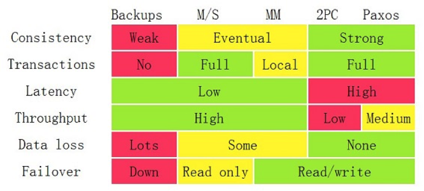

[toc]
# 025 分布式系统关键技术：流量与数据调度

关于流量调度，现在很多架构师都把这个事和服务治理混为一谈了。我觉得还是应该分开的。一方面，服务治理是内部系统的事，而流量调度可以是内部的，更是外部接入层的事。另一方面，服务治理是数据中心的事，而流量调度要做得好，应该是数据中心之外的事，也就是我们常说的边缘计算，是应该在类似于 CDN 上完成的事。

所以，流量调度和服务治理是在不同层面上的，不应该混在一起，所以在系统架构上应该把它们分开。

# 流量调度的主要功能

对于一个流量调度系统来说，其应该具有的主要功能是：

1. 依据系统运行的情况，自动地进行流量调度，在无需人工干预的情况下，提升整个系统的稳定性；
2. 让系统应对爆品等突发事件时，在弹性计算扩缩容的较长时间窗口内或底层资源消耗殆尽的情况下，保护系统平稳运行。

这还是为了提高系统架构的稳定性和高可用性。

此外，这个流量调度系统还可以完成以下几方面的事情。

* **服务流控**。服务发现、服务路由、服务降级、服务熔断、服务保护等。
* **流量控制**。负载均衡、流量分配、流量控制、异地灾备（多活）等。
* **流量管理**。协议转换、请求校验、数据缓存、数据计算等。

所有的这些都应该是一个 API Gateway 应该做的事。

# 流量调度的关键技术

但是，作为一个 API Gateway 来说，因为要调度流量，首先需要扛住流量，而且还需要有一些比较轻量的业务逻辑，所以一个好的 API Gateway 需要具备以下的关键技术。

1. **高性能**。API Gateway 必须使用高性能的技术，所以，也就需要使用高性能的语言。
2. **扛流量**。要能扛流量，就需要使用集群技术。集群技术的关键点是在集群内的各个结点中共享数据。这就需要使用像 Paxos、Raft、Gossip 这样的通讯协议。因为 Gateway 需要部署在广域网上，所以还需要集群的分组技术。
3. **业务逻辑**。API Gateway 需要有简单的业务逻辑，所以，最好是像 AWS 的 Lambda 服务一样，可以让人注入不同语言的简单业务逻辑。
4. **服务化**。一个好的 API Gateway 需要能够通过 Admin API 来不停机地管理配置变更的，而不是通过一个.conf 文件来人肉地修改配置。

基于上述的这几个技术要求，就其本质来说，目前可以做成这样的 API Gateway 几乎没有。这也是为什么我现在自己开发一个的原因。你可以到我的官网 MegaEase.com 上查看相关的产品和技术信息。

# 状态数据调度

对于服务调度来说，最难办的就是有状态的服务了。这里的状态是 State，也就是说，有些服务会保存一些数据，而这些数据是不能丢失的，所以，这些数据是需要随服务一起调度的。

一般来说，我们会通过"转移问题"的方法来让服务变成"无状态的服务"。也就是说，会把这些有状态的东西存储到第三方服务上，比如 Redis、MySQL、ZooKeeper，或是 NFS、Ceph 的文件系统中。

这些"转移问题"的方式把问题转移到了第三方服务上，于是自己的 Java 或 PHP 服务中没有状态，但是 Redis 和 MySQL 上则有了状态。所以，我们可以看到，现在的分布式系统架构中出问题的基本都是这些存储状态的服务。

因为数据存储结点在 Scale 上比较困难，所以成了一个单点的瓶颈。

# 分布式事务一致性的问题

要解决数据结点的 Scale 问题，也就是让数据服务可以像无状态的服务一样在不同的机器上进行调度，就会涉及数据的 replication 问题。而数据 replication 则会带来数据一致性的问题，进而对性能带来严重的影响。

要解决数据不丢的问题，只能通过数据冗余的方法，就算是数据分区，每个区也需要进行数据冗余处理。这就是数据副本。当出现某个节点的数据丢失时，可以从副本读到。数据副本是分布式系统解决数据丢失异常的唯一手段。简单来说：

1. 要想让数据有高可用性，就得写多份数据。
2. 写多份的问题会导致数据一致性的问题。
3. 数据一致性的问题又会引发性能问题。

在解决数据副本间的一致性问题时，我们有一些技术方案。

* Master-Slave 方案。
* Master-Master 方案。
* 两阶段和三阶段提交方案。
* Paxos 方案。

你可以仔细地读一下我在 3 年前写的[《分布式系统的事务处理》这篇文章](https://coolshell.cn/articles/10910.html)。其中我引用了 Google App Engine 联合创始人赖安·巴里特（Ryan Barrett）在 2009 年 Google I/O 上的演讲[Transaction Across DataCenter 视频](https://www.youtube.com/watch?v=srOgpXECblk) 中的一张图。

从上面这张经典的图中，我们可以看到各种不同方案的对比。

现在，很多公司的分布式系统事务基本上都是两阶段提交的变种。比如：阿里推出的 TCC--Try--Confirm--Cancel，或是我在亚马逊见到的 Plan--Reserve--Confirm 的方式，等等。凡是通过业务补偿，或是在业务应用层上做的分布式事务的玩法，基本上都是两阶段提交，或是两阶段提交的变种。

换句话说，迄今为止，在应用层上解决事务问题，只有"两阶段提交"这样的方式，而在数据层解决事务问题，Paxos 算法则是不二之选。

# 数据结点的分布式方案

真正完整解决数据 Scale 问题的应该还是数据结点自身。只有数据结点自身解决了这个问题，才能做到对上层业务层的透明，业务层可以像操作单机数据库一样来操作分布式数据库，这样才能做到整个分布式服务架构的调度。

也就是说，这个问题应该解决在数据存储方。但是因为数据存储结果有太多不同的 Scheme，所以现在的数据存储也是多种多样的，有文件系统，有对象型的，有 Key-Value 式，有时序的，有搜索型的，有关系型的......

这就是为什么分布式数据存储系统比较难做，因为很难做出来一个放之四海皆准的方案。类比一下编程中的各种不同的数据结构你就会明白为什么会有这么多的数据存储方案了。

但是我们可以看到，这个"数据存储的动物园"中，基本上都在解决数据副本、数据一致性和分布式事务的问题。

比如：AWS 的 Aurora，就是改写了 MySQL 的 InnoDB 引擎。为了承诺高可用的 SLA，需要写 6 个副本。其不像国内的 MySQL 的通过 bin log 的数据复制，而是更为"惊艳"地复制 SQL 语句，然后拼命地使用各种 tricky 的方式来降低 latency。比如，使用多线程并行、使用 SQL 操作的 merge 等。

MySQL 官方也有 MySQL Cluster 的技术方案。此外，MongoDB、国内的 PingCAP 的 TiDB、国外的 CockroachDB，还有阿里的 OceanBase 都是为了解决大规模数据的写入和读取的问题而出现的数据库软件。所以，我觉得成熟的可以用到生产线上的分布式数据库这个事估计也不远了。

而对于一些需要文件存储的，则需要分布式文件系统的支持。试想，一个 Kafka 或 ZooKeeper 需要把它们的数据存储到文件系统上。当这个结点有问题时，我们需要再启动一个 Kafka 或 ZooKeeper 的实例，那么也需要把它们持久化的数据搬迁到另一台机器上。

（注意，虽然 Kafka 和 ZooKeeper 是 HA 的，数据会在不同的结点中进行复制，但是我们也应该搬迁数据，这样有利用于新结点的快速启动。否则，新的结点需要等待数据同步，这个时间会比较长，可能会导致数据层的其它问题。）

于是，我们就需要一个底层是分布式的文件系统，这样新的结点只需要做一个简单的远程文件系统的 mount 就可以把数据调度到另外一台机器上了。

所以，真正解决数据结点调度的方案应该是底层的数据结点。在它们上面做这个事才是真正有效和优雅的。而像阿里的用于分库分表的数据库中间件 TDDL 或是别的公司叫什么 DAL 之类的这样的中间件都会成为过渡技术。

## 状态数据调度小结

我们对状态数据调度做个小小的总结。

* 对于应用层上的分布式事务一致性，只有两阶段提交这样的方式。
* 而底层存储可以解决这个问题的方式是通过一些像 Paxos、Raft 或是 NWR 这样的算法和模型来解决。
* 状态数据调度应该是由分布式存储系统来解决的，这样会更为完美。但是因为数据存储的 Scheme 太多，所以，导致我们有各式各样的分布式存储系统，有文件对象的，有关系型数据库的，有 NoSQL 的，有时序数据的，有搜索数据的，有队列的......

总之，我相信状态数据调度应该是在 IaaS 层的数据存储解决的问题，而不是在 PaaS 层或者 SaaS 层来解决的。

在 IaaS 层上解决这个问题, 一般来说有三种方案，一种是使用比较廉价的开源产品，如：NFS、Ceph、TiDB、CockroachDB、ElasticSearch、InfluxDB、MySQL Cluster 和 Redis Cluster 之类的；另一种是用云计算厂商的方案。当然，如果不差钱的话，可以使用更为昂贵的商业网络存储方案。

# 小结

回顾一下今天分享的主要内容。首先，我先明确表态，不要将流量调度和服务治理混为一谈 (当然，服务治理是流量调度的前提)，并比较了两者有何不同。然后，讲述了流量调度的主要功能和关键技术。接着进入本文的第二个话题------状态数据调度，讲述了真正完整解决数据 Scale 问题的应该还是数据结点自身，并给出了相应的技术方案，随后对状态数据调度进行了小结。

欢迎你也谈一谈经历过的技术场景中是采用了哪些流量和数据调度的技术和产品，遇到过什么样的问题，是怎样解决的？

下篇文章中，我们将开启一个全新的话题------洞悉 PaaS 平台的本质。  
