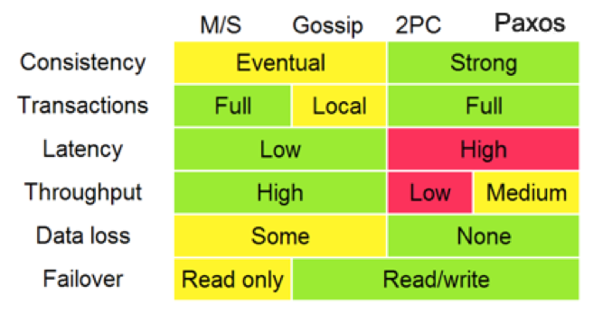
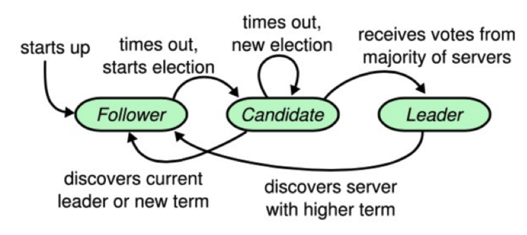
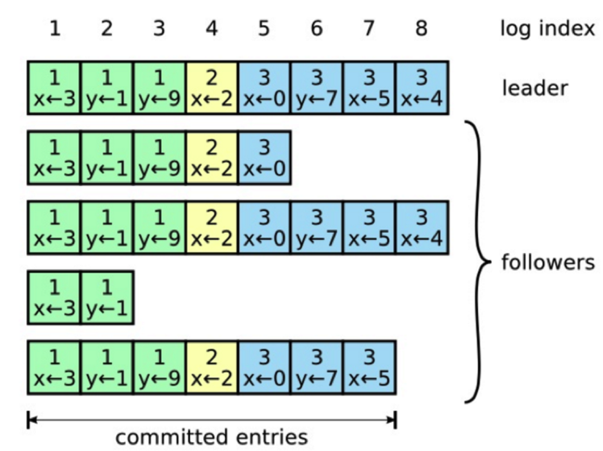
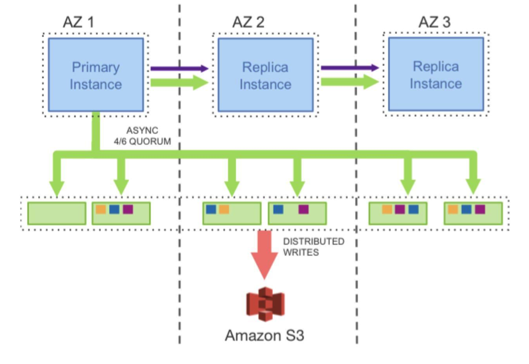
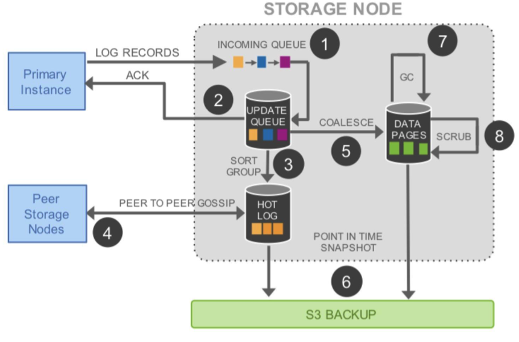
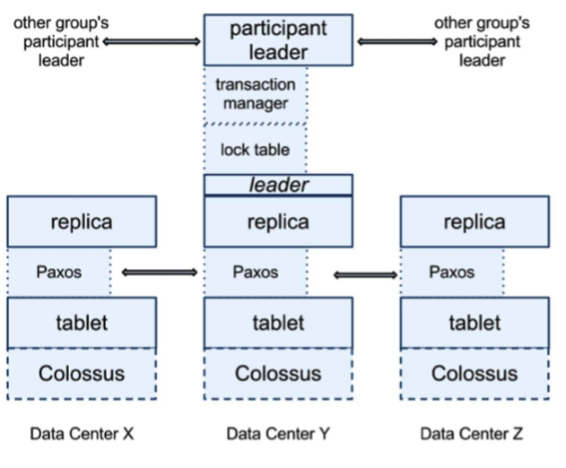
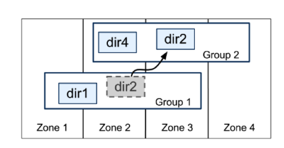

[toc]
# 032 推荐阅读：分布式数据调度相关论文

我们在之前的系列文章《分布式系统架构的本质》中说过，分布式系统的一个关键技术是"数据调度"。因为我们需要扩充节点，提高系统的高可用性，所以必需冗余数据结点。建立数据结点的副本看上去容易，但其中最大的难点就是分布式一致性的问题。下面，我会带你看看数据调度世界中的一些技术点以及相关的技术论文。

对于分布式的一致性问题，相信你在前面看过好几次下面这张图。从中，我们可以看出，Paxos 算法的重要程度。还有人说，分布式下真正的一致性算法只有 Paxos 算法。

# Paxos 算法

Paxos 算法，是莱斯利·兰伯特（Lesile Lamport）于 1990 年提出来的一种基于消息传递且具有高度容错特性的一致性算法。但是这个算法太过于晦涩，所以，一直以来都处于理论上的论文性质的东西。

其进入工程圈的源头在于 Google 的 Chubby lock------一个分布式的锁服务，用在了 Bigtable 中。直到 Google 发布了下面的这两篇论文，Paxos 才进入到工程界的视野中来。

* [Bigtable: A Distributed Storage System for Structured Data](https://static.googleusercontent.com/media/research.google.com/en//archive/bigtable-osdi06.pdf)
* [The Chubby lock service for loosely-coupled distributed systems](https://static.googleusercontent.com/media/research.google.com/en//archive/chubby-osdi06.pdf)

Google 与 Big Table 相齐名的还有另外两篇论文。

* [The Google File System](https://static.googleusercontent.com/media/research.google.com/en//archive/gfs-sosp2003.pdf)
* [MapReduce: Simplifed Data Processing on Large Clusters](https://static.googleusercontent.com/media/research.google.com/en//archive/mapreduce-osdi04.pdf)

不过，这几篇论文中并没有讲太多的 Paxos 算法细节上的内容，反而在论文[Paxos Made Live -- An Engineering Perspective](https://static.googleusercontent.com/media/research.google.com/en//archive/paxos_made_live.pdf) 中提到了很多工程实现的细节。比如，Google 实现 Paxos 时遇到的各种问题和解决方案，讲述了从理论到实际应用二者之间巨大的鸿沟。

尤其在满地都是坑的分布式系统领域，这篇论文没有过多讨论 Paxos 算法本身，而是在讨论如何将理论应用到实践，如何弥补理论在实践中的不足，如何取舍，如何测试，这些在实践中的各种问题才是工程的魅力。所以建议你读一读。

Paxos 算法的原版论文我在这里就不贴了，因为一来比较晦涩，二来也不易懂。推荐一篇比较容易读的------[Neat Algorithms - Paxos](http://harry.me/blog/2014/12/27/neat-algorithms-paxos/) ，这篇文章中还有一些小动画帮助你读懂。还有一篇可以帮你理解的文章是[Paxos by Examples](https://angus.nyc/2012/paxos-by-example/)。

如果你要自己实现 Paxos 算法，这里有几篇文章供你参考。

* [Paxos Made Code](http://www.inf.usi.ch/faculty/pedone/MScThesis/marco.pdf) , 作者是马克罗·普里米 (Macro Primi)，他实现了一个 Paxos 开源库[libpaxos](http://libpaxos.sourceforge.net/)。
* [Paxos for System Builders](http://www.cnds.jhu.edu/pub/papers/cnds-2008-2.pdf) , 以一个系统实现者的角度讨论了实现 Paxos 的诸多具体问题，比如 Leader 选举、数据及消息类型、流控等。
* [Paxos Made Moderately Complex](http://www.cs.cornell.edu/courses/cs7412/2011sp/paxos.pdf)，这篇文章比较新，是 2011 年才发表的。文中介绍了很多实现细节，并提供了很多伪代码，一方面可以帮助理解 Paxos，另一方面也可以据此实现一个 Paxos。
* [Paxos Made Practical](https://web.stanford.edu/class/cs340v/papers/paxos.pdf)主要介绍如何采用 Paxos 实现 replication。

除了马克罗·普里米的那个开源实现外，到 GitHub 上找一下，你就会看到这些项目：[Plain Paxos Implementations Python \& Java](https://github.com/cocagne/paxos)、[A go implementation of the Paxos algorithm](https://github.com/xiang90/paxos) 。

ZooKeeper 有和 Paxos 非常相似的一些特征，比如，领导选举、提案号等，但是它本质上不是 Paxos 协议，而是自己发明的 Zab 协议，有兴趣的话，可以读一下这篇论文： [Zab: High-Performance broadcast for primary-backup systems](https://pdfs.semanticscholar.org/fc11/031895c302dc52404d34de58af1a72f3b817.pdf)。

上述的 Google File System、MapReduce、Bigtable 并称为"谷三篇"。基本上来说，整个世界工程系统因为这三篇文章，开始向分布式系统演化，而云计算中的很多关键技术也是因为这三篇文章才得以成熟。 后来，雅虎公司也基于这三篇论文开发了一个开源的软件------Hadoop。

# Raft 算法

因为 Paxos 算法太过于晦涩，而且在实际的实现上有太多的坑，并不太容易写对。所以，有人搞出了另外一个一致性的算法，叫 Raft。其原始论文是[In search of an Understandable Consensus Algorithm (Extended Version)](https://raft.github.io/raft.pdf)寻找一种易于理解的 Raft 算法。这篇论文的译文在 InfoQ 上《[Raft 一致性算法论文译文](http://www.infoq.com/cn/articles/raft-paper)》，推荐你读一读。

Raft 算法和 Paxos 的性能和功能是一样的，但是它和 Paxos 算法的结构不一样，这使 Raft 算法更容易理解并且更容易实现。那么 Raft 是怎样做到的呢？

Raft 把这个一致性的算法分解成了几个部分，一个是领导选举（Leader Selection），一个是日志复制（Log Replication），一个是安全性（Safety），还有一个是成员变化（Membership Changes）。对于一般人来说，Raft 协议比 Paxos 的学习曲线更低，也更平滑。

Raft 协议中有一个状态机，每个结点会有三个状态，分别是 Leader、Candidate 和 Follower。Follower 只响应其他服务器的请求，如果没有收到任何信息，它就会成为一个 Candidate，并开始进行选举。收到大多数人同意选票的人会成为新的 Leader。

一旦选举出了一个 Leader，它就开始负责服务客户端的请求。每个客户端的请求都包含一个要被复制状态机执行的指令。Leader 首先要把这个指令追加到 log 中形成一个新的 entry，然后通过 AppendEntries RPC 并行地把该 entry 发给其他服务器（server）。如果其他服务器没发现问题，复制成功后会给 Leader 一个表示成功的 ACK。

Leader 收到大多数 ACK 后应用该日志，返回客户端执行结果。如果 Follower 崩溃 （crash）或者丢包，Leader 会不断重试 AppendEntries RPC。

这里推荐几个不错的 Raft 算法的动画演示。

* [Raft -- The Secret Lives of Data](http://thesecretlivesofdata.com/raft/)
* [Raft Consensus Algorithm](https://raft.github.io/)
* [Raft Distributed Consensus Algorithm Visualization](http://kanaka.github.io/raft.js/)

# 逻辑钟和向量钟

后面，业内又搞出来一些工程上的东西，比如 Amazon 的 DynamoDB，其论文[Dynamo: Amazon's Highly Available Key Value Store](http://bnrg.eecs.berkeley.edu/~randy/Courses/CS294.F07/Dynamo.pdf) 的影响力非常大。这篇论文中讲述了 Amazon 的 DynamoDB 是如何满足系统的高可用、高扩展和高可靠的。其中展示了系统架构是如何做到数据分布以及数据一致性的。

GFS 采用的是查表式的数据分布，而 DynamoDB 采用的是计算式的，也是一个改进版的通过虚拟结点减少增加结点带来数据迁移的一致性哈希。另外，这篇论文中还讲述了一个 NRW 模式用于让用户可以灵活地在 CAP 系统中选取其中两项，这使用到了 Vector Clock------向量时钟来检测相应的数据冲突。最后还介绍了使用 Handoff 的机制对可用性的提升。

这篇文章中有几个关键的概念，一个是 Vector Clock，另一个是 Gossip 协议。

提到向量时钟就需要提一下逻辑时钟。所谓逻辑时间，也就是在分布系统中为了解决消息有序的问题，由于在不同的机器上有不同的本地时间，这些本地时间的同步很难搞，会导致消息乱序。

于是 Paxos 算法的发明人兰伯特（Lamport）搞了个向量时钟，每个系统维护一个本地的计数器，这就是所谓的逻辑时钟。每执行一个事件（例如向网络发送消息，或是交付到应用层）都对这个计数器做加 1 操作。当跨系统的时候，在消息体上附着本地计算器，当接收端收到消息时，更新自己的计数器（取对端传来的计数器和自己当成计数器的最大值），也就是调整自己的时钟。

逻辑时钟可以保证，如果事件 A 先于事件 B，那么事件 A 的时钟一定小于事件 B 的时钟，但是返过来则无法保证，因为返过来没有因果关系。所以，向量时钟解释了因果关系。向量时钟维护了数据更新的一组版本号（版本号其实就是使用逻辑时钟）。

假如一个数据需要存在三个结点上 A、B、C。那么向量维度就是 3，在初始化的时候，所有结点对于这个数据的向量版本是 \[A:0, B:0, C:0\]。当有数据更新时，比如从 A 结点更新，那么，数据的向量版本变成 \[A:1, B:0, C:0\]，然后向其他结点复制这个版本，其在语义上表示为我当前的数据是由 A 结果更新的，而在逻辑上则可以让分布式系统中的数据更新的顺序找到相关的因果关系。

这其中的逻辑关系，你可以看一下[马萨诸塞大学课程 Distributed Operating System](http://lass.cs.umass.edu/~shenoy/courses/spring05/lectures.html)中第 10 节[Clock Synchronization](http://lass.cs.umass.edu/~shenoy/courses/spring05/lectures/Lec10.pdf)这篇讲议。关于 Vector Clock，你可以看一下[Why Vector Clocks are Easy](http://basho.com/posts/technical/why-vector-clocks-are-easy/)和[Why Vector Clocks are Hard](http://basho.com/posts/technical/why-vector-clocks-are-hard/) 这两篇文章。

# Gossip 协议

另外，DynamoDB 中使用到了 Gossip 协议来做数据同步，这个协议的原始论文是 [Efficient Reconciliation and Flow Control for Anti-Entropy Protocols](https://www.cs.cornell.edu/home/rvr/papers/flowgossip.pdf)。Gossip 算法也是 Cassandra 使用的数据复制协议。这个协议就像八卦和谣言传播一样，可以 "一传十、十传百"传播开来。但是这个协议看似简单，细节上却非常麻烦。

根据这篇论文，节点之间存在三种通信方式。

* push 方式。A 节点将数据 (key,value,version) 及对应的版本号推送给 B 节点，B 节点更新 A 中比自己新的数据。
* pull 方式。A 仅将数据 key,version 推送给 B，B 将本地比 A 新的数据 (key,value,version) 推送给 A，A 更新本地。
* push/pull 方式。与 pull 类似，只是多了一步，A 再将本地比 B 新的数据推送给 B，B 更新本地。

如果把两个节点数据同步一次定义为一个周期，那么在一个周期内，push 需通信 1 次，pull 需 2 次，push/pull 则需 3 次。从效果上来讲，push/pull 最好，理论上一个周期内可以使两个节点完全一致。直观感觉上，也是 push/pull 的收敛速度最快。

另外，每个节点上的又需要一个协调机制，也就是如何交换数据能达到最快的一致性------消除节点的不一致性。上面所讲的 push、pull 等是通信方式，协调是在通信方式下的数据交换机制。

协调所面临的最大问题是，一方面需要找到一个经济的方式，因为不可能每次都把一个节点上的数据发送给另一个节点；另一方面，还需要考虑到相关的容错方式，也就是当因为网络问题不可达的时候，怎么办？

一般来说，有两种机制：一种是以固定概率传播的 Anti-Entropy 机制，另一种是仅传播新到达数据的 Rumor-Mongering 机制。前者有完备的容错性，但是需要更多的网络和 CPU 资源，后者则反过来，不耗资源，但在容错性上难以保证。

Anti-Entropy 的机制又分为 Precise Reconciliation（精确协调）和 Scuttlebutt Reconciliation（整体协调）这两种。前者希望在每次通信周期内都非常精确地消除双方的不一致性，具体表现就是互发对方需要更新的数据。因为每个结点都可以读写，所以这需要每个数据都要独立维护自己的版本号。

而整体协调与精确协调不同的是，整体协调不是为每个数据都维护单独的版本号，而是每个节点上的数据统一维护一个版本号，也就是一个一致的全局版本。这样与其他结果交换数据的时候，就只需要比较节点版本，而不是数据个体的版本，这样会比较经济一些。如果版本不一样，则需要做精确协调。

因为篇幅问题，这里就不多说了，你可以看看原始的论文，还可以去看看 Cassandra 中的源码，以及到 GitHub 搜一下其他人的实现。多说一句，Cassandra 的实现是基于整体协调的 push/pull 模式。

关于 Gossip 的一些图示化的东西，你可以看一下动画[gossip visualization](https://rrmoelker.github.io/gossip-visualization/)。

# 分布式数据库方面

上面讲的都是一些基本概念相关的东西，下面我们来谈谈数据库方面的一些论文。

一篇是 AWS Aurora 的论文 [Amazon Aurora: Design Considerations for High Throughput Cloud --Native Relation Databases](http://www.allthingsdistributed.com/files/p1041-verbitski.pdf)。

Aurora 是 AWS 将 MySQL 的计算和存储分离后，计算节点 scale up，存储节点 scale out。并把其 redo log 独立设计成一个存储服务，把分布式的数据方面的东西全部甩给了底层存储系统。从而提高了整体的吞吐量和水平的扩展能力。

Aurora 要写 6 份拷贝，但是其只需要把一个 Quorum 中的日志写成功就可以了。如下所示。可以看到，将存储服务做成一个跨数据中心的服务，提高数据库容灾，降低性能影响。

对于存储服务的设计，核心的原理就是 latency 一定要低，毕竟写 6 个 copy 是一件开销很大的事。所以，基本上来说，Aurora 用的是异步模型，然后拼命地做并行处理，其中用到的也是 Gossip 协议。如下所示。

在上面这个图中，我们可以看到，完成前两步，就可以 ACK 回调用方。也就是说，只要数据在本地落地了，就可以返回成功了。然后，对于六个副本，这个 log 会同时发送到 6 个存储结点，只需要有大于 4 个成功 ACK，就算写成功了。第 4 步我们可以看到用的是 Gossip 协议。然后，第 5 步产生 cache 页，便于查询。第 6 步在 S3 做 Snapshot，类似于 Checkpoint。

第二篇比较有代表的论文是 Google 的 [Spanner: Google's Globally-Distributed Database](https://static.googleusercontent.com/media/research.google.com/zh-CN//archive/spanner-osdi2012.pdf)。 Spanner 是 Google 的全球分布式数据库 Globally-Distributed Database) 。Spanner 的扩展性达到了令人咋舌的全球级，可以扩展到数百万台机器，数以百计的数据中心，上万亿的行。更给力的是，除了夸张的扩展性之外，它还能同时通过同步复制和多版本来满足外部一致性，可用性也是很好的。

下面是 Spanserver 的一个架构。

我们可以看到，每个数据中心都会有一套 Colossus，这是第二代的 GFS。每个机器有 100-1000 个 tablet，也就是相当数据库表中的行集，物理存储就是数据文件。比如，一张表有 2000 行，然后有 20 个 tablet，那么每个 tablet 分别有 100 行数据。

在 tablet 上层通过 Paxos 协议进行分布式跨数据中心的一致性数据同步。Paxos 会选出一个 replica 做 Leader，这个 Leader 的寿命默认是 10s，10s 后重选。Leader 就相当于复制数据的 master，其他 replica 的数据都是从它那里复制的。读请求可以走任意的 replica，但是写请求只有去 Leader。这些 replica 统称为一个 Paxos Group。

Group 之间也有数据交互传输，Google 定义了最小传输复制单元 directory，是一些有共同前缀的 key 记录，这些 key 也有相同的 replica 配置属性。

目前，基于 Spanner 论文的开源实现有两个，一个是 Google 公司自己的人出来做的[CockroachDB](https://github.com/cockroachdb/cockroach)，另一个是国人做的[TiDB](https://github.com/pingcap/tidb)。

# 小结

正如我在之前的分布式系统的本质文章里所说到的，分布式的服务的调度需要一个分布式的存储系统来支持服务的数据调度。而我们可以看到，各大公司都在分布式的数据库上做各种各样的创新，他们都在使用底层的分布式文件系统来做存储引擎，把存储和计算分离开来，然后使用分布式一致性的数据同步协议的算法来在上层提供高可用、高扩展的支持。

从这点来看，可以预见到，过去的分库分表并通过一个数据访问的代理服务的玩法，应该在不久就会过时就会成为历史。真正的现代化的分布式数据存储就是 Aurora 和 Spanner 这样的方式。

通过上面的这些论文和相关的工程实践以及开源项目，相信可以让你在细节方面对分布式中最难的一块------数据调度方面有更多的认识。

(**这篇文章中提到了大量的英文文章和论文，担心读者听音频时很难理解和对应，所以没有录制音频，敬望谅解。**)  
