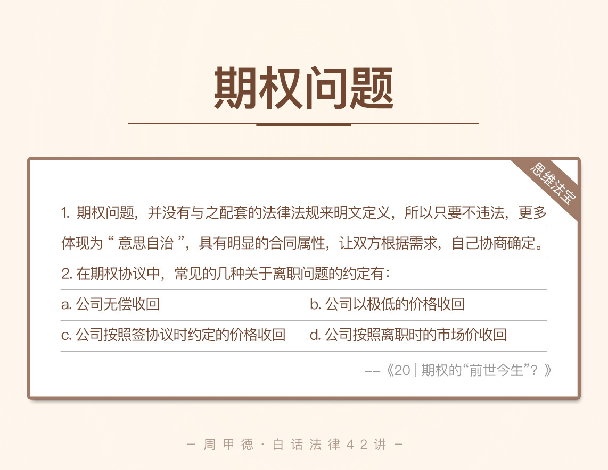

[toc]
# 11 期权的"前世今生"

要说现在创业公司员工的两大迷雾，无非是相当火热的"股权"和"期权"。前面我们学完股权内容后，不少留言都在问，期权究竟是怎么回事，离职后期权要怎么处理？因为查不到相应的法律法规，期权成了不少人的盲区。今天，我们就来揭开这个神秘面纱，说说期权问题。

先来看这么一个场景，你应该也很熟悉。创业公司的员工小新，工作三年后准备离职，但是对手头的期权犯了难。他们当时签订的期权协议书规定：

1. 如果小新工作满五年，就可以得到5%的股权；

2. 如果小新在工作满五年后，提出了离职，公司可按市场公允价格回购。

可是，小新现在工作不满五年，就准备要离职，协议里并没有约定这样的情况，那该怎么办呢？

期权究竟是什么，应该如何看待呢？我们先来了解一些基本的概念再做解答。

## 期权知识

"期权"，字面上可以理解为，你所期待的未来可能实现的某种权利。在一家公司里，你最期待的权利是什么呢？自然是股权。

所以，期权，**本质上**是由公司或创始人书面承诺，在达成某项成就或者符合其他条件时，给某人一定比例的股权，让其可以成为公司的股东。

期权的持有者，一般都是公司培养的核心员工，或是在业界有一定资源的管理人员。

关于核心员工问题，公司为了留住优秀人才，会和员工签署期权协议。一般拿出一部分股权，以期权的形式给到员工手里。这种情况下，一般只要达到协议约定的**行权条件**（如工作年限、工作业绩等），员工就能获得股权，成为公司的实际股东。

核心员工获得股权的方式通常有两种，取决于最初的约定。

* 一种是无偿得到股权；

* 另一种是按协议约定的价格购买股权，当然，这个价格会远远低于市场价格。

关于有资源的人才问题，这些人可能拥有高超的技术能力、丰富的管理经验，或是巨大的市场资源等，这些无形财富对创业公司尤为重要。所以，这些人在加入公司时，一般也会被授予期权，到一定的年限后则会无偿授予。

其实除了上面这两种人才问题，还有一种情况，介于两者之间，可能也是我们很熟悉的一种模式。有些员工会选择去创业公司拿更低的工资，比如在其他大公司的工资是每月6万，而作为创业公司核心成员，只拿3万的月薪。

这些人的目的也很明确，就是为了等待公司发展壮大，一旦条件成熟，就能转为股东，拿到股权。这样的附属条件，其实也是一种期权。

目前，期权协议常见的**行权期限** 是4年或5年，实现方式通常为**分期行权**，具体主要有这么两种方式。

* 一种是"一年一变更"，每满一年，按约定条件，把期权按比例转为股权。比如说约定了五年期限，而工作每满一年，你就可以把期权总额的20%转为股权，成为股东。满五年后，期权就全部转为股权了。

* 一种是"两年一变更"，前两年按比例转换一次股权，剩下的满年限后再一次性全转完。

## 情景分析

现在，再来看小新的问题。小新和公司签订的协议里约定了，行权条件是满五年，也就是说工作五年后才能拿到期权。现在刚刚工作三年，小新就想离职，那么根据目前信息来看，小新不能达到当初约定的条件，也就不能主张期权相对应的利益。

这样的情况下，如果你是小新，你就得仔细权衡利弊了，是要放弃期权跳槽到新的岗位，还是说延缓离职，继续工作，五年之后再考虑离职问题。其实到时候，想法会不会改变，也并不好说了。

其实，从我的分析中，你应该能看出，期权的本质，还是我们类似于所说的协议，或者叫合同。不同于股权，股权是要写入公司章程，在法律上有明确地位的。期权协议，是双方自愿达成的合同，所以相对应的权利义务，都是提前约定好，白纸黑字记录下来的。

既然是合同，那么"期转股"的条件，自然可以由双方协商来确定。只是**在实际操作中，期权协议一般都是格式合同**。公司会提前公示期权条件，面向所有核心员工，并且统一适用。员工很难通过谈判来更改条件。

不过，按照目前情况来看，公司推出期权的目的就是想留住人才，而市场竞争又这么激烈，想要留人，肯定得拿出足够丰厚的条件来打动人心。所以，大多数公司的期权行权条件还是比较厚道的。

## 思维法宝

期权问题并没有配套的法律法规明文定义，所以只要不违法，期权更多体现为"意思自治"，也就是具有明显的合同属性，让双方根据需求，自己协商确定。

这里，我也总结了几种常见的"期权离职"约定。

**第一，公司无偿收回**。这种情况，通常是因为员工严重违反了公司的规章制度，损害了公司利益，也就是协议里约定的"对不起"公司的事儿，那么，按照约定，期权就会被公司无偿收回。

比如说，有些地方会约定，如果你不满某个年限就离职，离职时公司就将无偿收回股权，并且以后也不会再给。

**第二，公司以极低的价格收回**。这种情况一般也是为了防止违约违规的行为。如果达不到某种条件，公司可能会按照创始人入资时的价格，或者其他极低的价格来收回。

**第三，公司按照签协议时约定的价格收回**。采用这种方式的相对比较少，毕竟和创业公司同甘共苦，等着公司发展壮大，想要行权、离职时，却只能按照签协议时约定的价格被公司收回。

**第四，公司按照离职时的市场价收回**。这种方式目前采用比较多，只要你符合期权的变现条件，一般会以上一轮融资价格为基数，乘以一个折扣，然后算出对应的股权价格，也是比较公允厚道的一个价格。

员工提前走人，肥肉在嘴边还没真正吞下去，确实是个比较尴尬的局面。这种情况下，公司和员工都有各自的委屈，也常常会使双方陷入僵局。

站在员工的角度来说，能拿期权的也不是一般人，加入这家公司，可能就是冲着上市来的。你拿者低于自己市价的工资，辛苦付出好几年，却因为身体或者家庭等原因必须离职。如果最后在钱上也是一无所得，心里能好受吗？

但站在公司的角度，说好的工作年限，现在还没到人就跳槽了，或是各种理由要离开了，公司的业务怎么办呢？对公司来说，这何尝不是一种背叛，也是经济和精神的双重打击。出现这种局面能怎么办？自然只能挽回一点是一点了。

所以，还是我们总说的，签字要慎重。签了某个协议，尤其像期权协议这类与金钱利益挂钩的协议，更应该尽量遵守约定，不要在未来某天，拿协议之外的各种理由来说事儿，既伤感情也伤钱啊！

对于期权话题，你见过哪些形式的期权约定吗？或者对于期权还有哪些地方存在疑惑吗？欢迎留言和我分享，也欢迎你把这篇文章分享给你的朋友。期权不是天上掉下来的馅饼，也不是已经到手的肥肉，协议才是我们的最大依据。  
